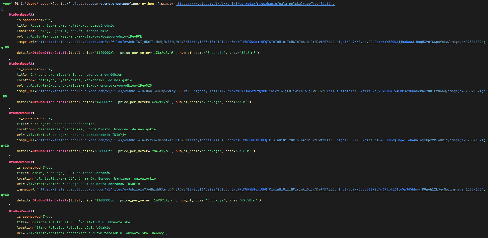

<a name="readme-top"></a>

[![Contributors][contributors-shield]][contributors-url]
[![Forks][forks-shield]][forks-url]
[![Stargazers][stars-shield]][stars-url]
[![Issues][issues-shield]][issues-url]
[![MIT License][license-shield]][license-url]
[![LinkedIn][linkedin-shield]][linkedin-url]


<br />
<div align="center">
  <h3 align="center">Otodom & Otomoto scraper</h3>

  <p align="center">
    Simple CLI application to collect data from otomoto.pl and otodom.pl
    <br />
    <br />
    <a href="https://github.com/DEENUU1/fjob_backend/issues">Report Bug</a>
    ·
    <a href="https://github.com/DEENUU1/fjob_backend/issues">Request Feature</a>
  </p>
</div>

#### Console output



#### JSON export format
##### Otodom
```json
[
    {
        "is_sponsored": true,
        "title": "! Studio, 3 osoby, balkon, topowe wyko\u0144czenie!",
        "location": "ul. Jana Kasprowicza, Ko\u0142obrzeg, ko\u0142obrzeski, zachodniopomorskie",
        "url": "/pl/oferta/studio-3-osoby-balkon-topowe-wykonczenie-ID4eNS2",
        "image_url": "https://ireland.apollo.olxcdn.com/v1/files/eyJmbiI6Im1neTc2bWg2Y2NjbzMtQVBMIiwidyI6W3siZm4iOiJlbnZmcXFlMWF5NGsxLUFQTCIsInMiOiIxNCIsInAiOiIxMCwtMTAiLCJhIjoiMCJ9XX0.B-NT5jkKj4RAlYV-XVVUKsS4iZmP9tQdz20XF9ZB1-U/image;s=1280x1024;q=80",
        "details": {
            "total_price": "518185z\u0142",
            "price_per_meter": "18500z\u0142/m\u00b2",
            "num_of_rooms": "1 pok\u00f3j",
            "area": "28,01 m\u00b2"
        }
    },

```
##### Otomoto
```json
[
    {
        "title": "Mercedes-Benz GLC 220 d 4-Matic AMG Line",
        "url": "https://www.otomoto.pl/osobowe/oferta/mercedes-benz-glc-glc-220d-4matic-amg-night-premium-distronic-salon-pl-fv23-ID6G2ho4.html",
        "image_url": "https://ireland.apollo.olxcdn.com/v1/files/eyJmbiI6ImJybzg0N2N3Mm50aS1PVE9NT1RPUEwifQ.eJBnMGCxy8p0QHWX74OPC9BMzAx_GWG2qvVKT2EGyYI/image;s=644x461",
        "type_of_seller": null,
        "price": "314 700",
        "price_currency": "PLN",
        "mileage": "23 772 km",
        "fuel_type": "Diesel",
        "gearbox": "Automatyczna",
        "year": "2022 "
    },
```

## Features

1. Scrape data from otodom.pl and otomoto.pl
2. Parse scraped data and export them to JSON file
3. Easy configuration, just use url with all filters included 

## Technologies:

#### Backend

- Python
  - Typer
  - requests
  - beautifulsoup4


## Installation

Clone repository
```bash
git clone https://github.com/DEENUU1/otodom-otomoto-scraper.git
```

Create virtual env
```bash
python -m venv venv 
```

Activate virtual env
```bash
.\venv\Scripts\activate
```

Install libraries
```bash
pip install -r requirements.txt
```

Change directory
```bash
cd app
```

Run script
```bash
python main.py <url> <page_limit> (default 1) <export_to> (default json)
```

For example:
```bash
python main.py https://www.otodom.pl/pl/wyniki/sprzedaz/mieszkanie/cala-polska?viewType=listing
```

```bash
python main.py https://www.otomoto.pl/osobowe 10 json
```


## Authors

- [@DEENUU1](https://www.github.com/DEENUU1)

<!-- LICENSE -->

## License

See `LICENSE.txt` for more information.


<!-- MARKDOWN LINKS & IMAGES -->
<!-- https://www.markdownguide.org/basic-syntax/#reference-style-links -->

[contributors-shield]: https://img.shields.io/github/contributors/DEENUU1/otodom-otomoto-scraper.svg?style=for-the-badge

[contributors-url]: https://github.com/DEENUU1/otodom-otomoto-scraper/graphs/contributors

[forks-shield]: https://img.shields.io/github/forks/DEENUU1/otodom-otomoto-scraper.svg?style=for-the-badge

[forks-url]: https://github.com/DEENUU1/otodom-otomoto-scraper/network/members

[stars-shield]: https://img.shields.io/github/stars/DEENUU1/otodom-otomoto-scraper.svg?style=for-the-badge

[stars-url]: https://github.com/DEENUU1/otodom-otomoto-scraper/stargazers

[issues-shield]: https://img.shields.io/github/issues/DEENUU1/otodom-otomoto-scraper.svg?style=for-the-badge

[issues-url]: https://github.com/DEENUU1/otodom-otomoto-scraper/issues

[license-shield]: https://img.shields.io/github/license/DEENUU1/otodom-otomoto-scraper.svg?style=for-the-badge

[license-url]: https://github.com/DEENUU1/otodom-otomoto-scraper/blob/master/LICENSE.txt

[linkedin-shield]: https://img.shields.io/badge/-LinkedIn-black.svg?style=for-the-badge&logo=linkedin&colorB=555

[linkedin-url]: https://linkedin.com/in/kacper-wlodarczyk

[basic]: https://github.com/DEENUU1/otodom-otomoto-scraper/blob/main/assets/v1_2/basic.gif?raw=true

[full]: https://github.com/DEENUU1/otodom-otomoto-scraper/blob/main/assets/v1_2/full.gif?raw=true

[search]: https://github.com/DEENUU1/otodom-otomoto-scraper/blob/main/assets/v1_2/search.gif?raw=true
